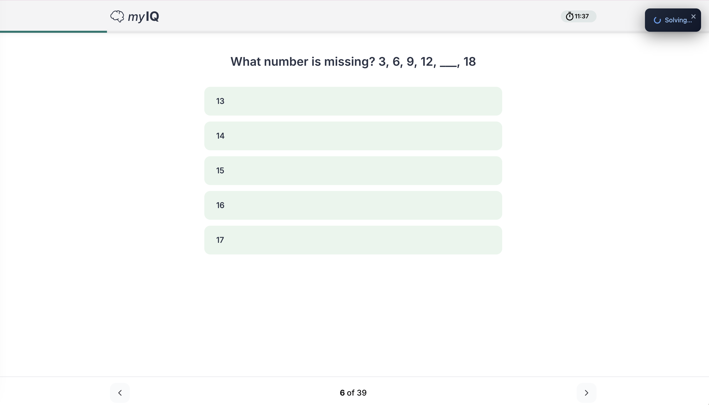
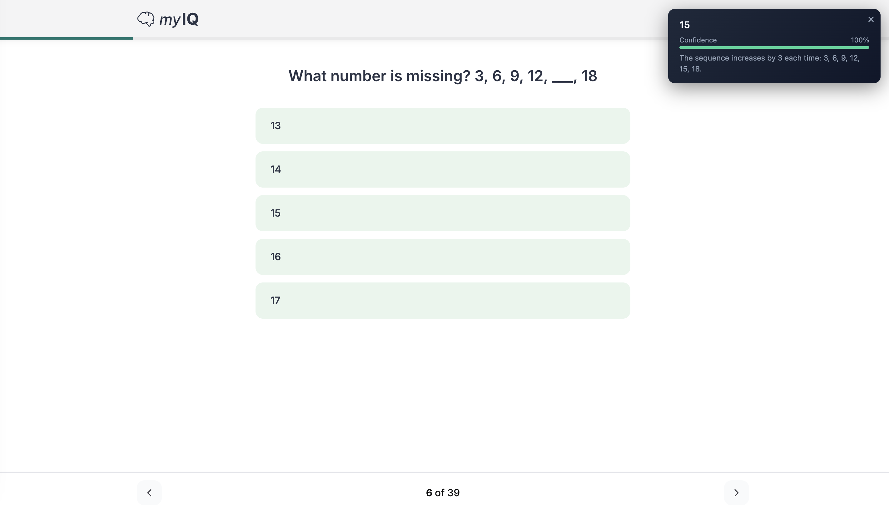

# CCAT Solver

[](LICENSE)

An AI-powered study companion that explains on-screen questions, walks through the reasoning, and highlights where your thinking went wrong — so you learn the *why*, not just the answer.

Built as a Manifest V3 Chrome extension with a local FastAPI backend.

### Use Cases

- **Study / practice mode** — Review practice tests after attempting them. The overlay explains the correct reasoning and shows where you went wrong, turning repetition into actual learning.
- **Accessibility** — Reads and structures on-screen content for users who benefit from AI-assisted comprehension of visual material.
- **MV3 reference implementation** — Clean example of offscreen canvas compression, content-script overlay UI, and a local backend proxy pattern for Chrome extension developers.

## How It Works

1. Press **Cmd+Shift+Y** (Mac) or **Ctrl+Shift+Y** (Windows/Linux)
2. The extension captures and compresses the visible tab (JPEG, 70% quality, max 1280px wide)
3. Sends it to a local FastAPI backend which forwards it to GPT-4.1-mini vision
4. The answer, confidence score, and rationale appear in a fixed overlay (top-right corner)

### Solving

The overlay shows a loading spinner while the backend processes the screenshot.



### Answer

Once the model responds, the overlay displays the answer with a confidence bar and rationale.



## Project Structure

```
CCAT-solver/
├── manifest.json          # MV3 extension manifest (hotkey, permissions, scripts)
├── sw.js                  # Service worker — capture → compress → POST → relay
├── offscreen.html/js      # Offscreen document for canvas-based JPEG compression
├── content.js             # Content script — renders the overlay UI
└── backend/
    ├── server.py           # FastAPI server — proxies to GPT-4.1-mini vision
    ├── requirements.txt    # Python dependencies
    ├── .env                # Your OpenAI API key (not committed)
    └── .env.example        # Template for .env
```

## Quick Start

```bash
git clone https://github.com/cep215/CCAT-solver.git
cd CCAT-solver
./dev.sh
```

On first run, `dev.sh` creates the venv, installs dependencies, and starts the backend. If `backend/.env` is missing it creates one and reminds you to paste your `OPENAI_API_KEY`.

The script prints the Chrome extension setup steps when it starts. Press **Cmd+Shift+Y** on any page and the overlay appears top-right.

## Troubleshooting

| Symptom | Cause | Fix |
|---|---|---|
| Hotkey does nothing | Shortcut not registered or conflicts with another extension | Check `chrome://extensions/shortcuts` and rebind |
| "Solving..." spinner never resolves | Backend not running or offscreen document failed | Verify `curl http://localhost:8000/health` returns `ok` |
| "Error" overlay: "Request timed out" | Backend took >12s (slow network or model overload) | Check backend logs; try again |
| "Error" overlay: "Backend returned 500" | Invalid or missing `OPENAI_API_KEY` | Check `backend/.env`; hit `/health` to confirm `openai_key_configured: true` |
| Extension not visible in Chrome | Not loaded or wrong folder selected | Re-load unpacked; make sure you select the repo root containing `manifest.json` |

## Permissions

| Permission | Reason |
|---|---|
| `activeTab` | Capture the visible tab screenshot |
| `scripting` | Inject content script into tabs not matched at load time |
| `offscreen` | Create an offscreen document for canvas-based image compression |

## Ethical Use

This tool is intended for **learning and accessibility** purposes only.

- **Do not** use on real hiring assessments, proctored exams, or graded tests.
- **Designed for** practice environments, self-study, and post-attempt review.
- **You are responsible** for compliance with the rules of any site or platform you use.

## Configuration

| Option | Location | Default |
|---|---|---|
| Backend URL | `sw.js` line 1 | `http://localhost:8000/screen-solve` |
| JPEG quality | `sw.js` `compressImage()` | `0.7` (70%) |
| Max image width | `sw.js` `compressImage()` | `1280` px |
| AI model | `backend/server.py` line 52 | `gpt-4.1-mini` |
| System prompt | `backend/prompt.txt` | See file |
| Request timeout | `sw.js` line 23 | `12000` ms |
| Overlay auto-hide | `content.js` line 3 | `15000` ms |

### Customizing the Prompt

The system prompt lives in `backend/prompt.txt` — edit it in any text editor, no Python required. The backend reads it on startup, so restart after changes.

The prompt must instruct the model to return valid JSON with `answer`, `confidence`, and `rationale` fields, or the backend will fail to parse the response.

### Changing the AI Model

Edit `backend/server.py`, find the `client.chat.completions.create(` call, and change the `model=` parameter:

```python
model="gpt-4.1-mini",   # fast + cheap (default)
model="gpt-4.1-nano",   # fastest, lower accuracy
model="gpt-4o",          # most capable, slower + more expensive
```

Restart the backend after changing.

## Known Limitations

- **Latency**: Typical end-to-end time is 3-8 seconds (screenshot capture ~100ms, compression ~200ms, API call 2-7s depending on model and image complexity). The 12-second timeout will abort slow requests.
- **Visible tab only**: Captures what's currently visible in the viewport — content below the fold or behind modals is not included.
- **Single answer**: The model returns one answer per screenshot. Multi-question pages may get a partial or combined response.
- **Model accuracy**: AI vision models can misread text, misinterpret diagrams, or hallucinate. Always verify answers against your own understanding.
- **No offline mode**: Requires a running backend and an active OpenAI API connection.
- **Chrome only**: Built for Chromium-based browsers (Chrome, Edge, Brave). Firefox and Safari are not supported.

## Privacy

**What is sent:**
- A compressed JPEG screenshot of your visible tab is sent to your **local backend** (`localhost:8000`), which forwards it to the OpenAI API for processing.

**What is NOT sent:**
- No browsing history, cookies, form data, passwords, or DOM content is collected or transmitted.
- The extension has no network permissions beyond what the service worker `fetch` does — it only contacts the backend URL you configure.

**Data retention:**
- OpenAI's data retention policies apply to the API call. See [OpenAI's API data usage policy](https://openai.com/enterprise-privacy/) for details.
- The local backend does not store screenshots or responses.

## Roadmap

- [ ] Configurable hotkey from extension popup
- [ ] Model selection dropdown (switch between GPT-4o, 4.1-mini, 4.1-nano without editing code)
- [ ] Local OCR fallback (Tesseract.js) for basic text extraction without API calls
- [ ] Multi-question detection (split and answer each question separately)
- [ ] Answer history panel (review past solves in a side panel)
- [ ] Firefox/Safari support via WebExtension polyfill

## Contributing

See [CONTRIBUTING.md](CONTRIBUTING.md) for setup instructions, project layout, and guidelines.

## License

[MIT](LICENSE)
